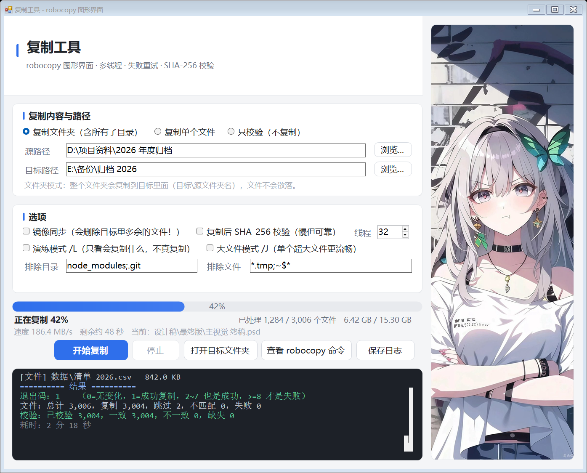

# 复制工具（robocopy 图形界面）

把 Windows 自带的 `robocopy` 包装成一个双击就能用的桌面小工具：选好源和目标就能复制文件/文件夹，带**真实进度条**（按字节算的百分比、速度、剩余时间）、**实时彩色日志**，复制完还能做 **SHA-256 校验**。零第三方依赖，全部源码在 `src\`，用 Windows 自带的 C# 编译器就能重新编译。



## 功能一览

- **两种界面版式**，功能完全相同、设置共用，安装向导里自选：
  - **立绘卡版**（`复制工具.exe`）——右侧圆角卡片展示完整人物立绘，功能卡片在左侧；
  - **透明背景版**（`复制工具-透明背景.exe`）——壁纸铺满整个窗口、卡片半透明，图片做整体氛围。
- **复制文件夹 / 单个文件**：文件夹整个复制到 `目标\源文件夹名`（和资源管理器一致），支持拖拽。
- **真实进度**：先扫描源目录统计总字节，边解析 robocopy 日志边折算百分比——不是假进度条。
- **可靠的成败判定**：退出码只是初判，还要核对日志汇总表、失败数、重试记录，杜绝"退出码 0 其实全没复制"的假成功；失败时保留诊断日志。
- **SHA-256 校验**：复制后逐文件比对（多线程并行，最多 8 线程）；也有独立的**只校验模式**，不复制、只比对源和目标。
- **常用选项**：镜像同步 `/MIR`（二次确认）、线程数 `/MT`、演练 `/L`、大文件 `/J`、排除目录/文件 `/XD /XF`。
- **高 DPI 适配**：125%/150% 缩放下坐标与字体整体换算，文字清晰不发虚。
- **完整安装体验**：安装向导（选版式 → 选位置 → 安装）、桌面/开始菜单快捷方式（自带管理员权限）、"程序和功能"卸载登记。

## 快速开始

**免安装使用**：从 GitHub 的 **Releases** 页下载成品包，解压后双击 `复制工具.exe`（立绘卡版）或 `复制工具-透明背景.exe`（壁纸铺满版），选源和目标，点"开始复制"。文件或文件夹可以直接拖进窗口；用过的路径会记住并自动补全。

**正式安装**：双击 Releases 成品包里的 `安装向导.exe`：

1. 弹一次管理员授权，点"是"
2. 欢迎页 → 下一步
3. **选择界面版式**：两个都装（默认）/ 只装立绘卡版 / 只装透明背景版
4. 选择安装位置（默认 `C:\Program Files\复制工具`）
5. 安装 → 完成，桌面和开始菜单的图标立即可用

卸载：Windows 设置 → 应用 →"复制工具"，或安装目录里的 `卸载复制工具.exe`。

设置保存在 `%APPDATA%\RobocopyGuiTool\settings.ini`，两种版式、重装升级都通用。

## 目录结构

```
复制软件开发\
├─ 界面预览.png                 预览截图（立绘卡版式）
├─ 界面预览-透明背景.png         预览截图（壁纸铺满版式）
├─ 图片\                       背景图原始素材（用户自备壁纸，不入库）
├─ src\                        全部 C# 源码 + 图标 + 管理员清单 + 嵌入用壁纸
│   ├─ Program.cs              入口（含 --backdrop 体验开关、--diagnose-dest 诊断模式）
│   ├─ MainForm.cs             主界面（两种版式共用，/define:BACKDROP 切换）
│   ├─ UiTheme.cs              配色、字体、DPI 缩放、自绘控件与背景图合成
│   ├─ RobocopyEngine.cs       引擎：扫描、参数拼装、日志解析、进度、并行校验
│   ├─ InstallerEngine.cs      安装/卸载逻辑（快捷方式、卸载登记、自删清理）
│   ├─ SetupWizard.cs          安装向导界面
│   ├─ Uninstaller.cs          卸载程序界面
│   ├─ SelfTest.cs             引擎自测用例（130 项）
│   ├─ UiPreview.cs            界面预览与布局/像素自检
│   ├─ app.ico / setup.manifest / wallpaper.jpg
├─ build.ps1                   编译脚本（由 编译.bat 调用）
├─ 编译.bat                    一键重新编译（纯 ASCII，自愈 build.ps1 的 BOM）
├─ 使用说明.md                 详细使用手册（选项说明、常见问题、13 条技术内幕）
└─ README.md                   本文件
```

## 重新编译

改完 `src\` 里的源码，**双击 `编译.bat`** 即可。它调用 `build.ps1`，用 Windows 自带的 C# 编译器（`%SystemRoot%\Microsoft.NET\Framework64\v4.0.30319\csc.exe`），不需要安装 Visual Studio 或 .NET SDK，需要 .NET Framework 4.x（Windows 10/11 自带）。

一次编译产出 6 个 exe：两种版式的主程序（同一份源码，用 `/define:BACKDROP` 区分）、引擎测试、界面预览、安装向导、卸载程序。背景图通过 csc 的 `/res` 直接嵌进 exe，所有程序仍是单文件、不依赖外部资源。exe 属编译产物，不入仓库；对外分发通过 GitHub Releases。

编译完成后建议按顺序质检（顺序很重要：先界面后逻辑）：

```
界面预览.exe                            → 布局/像素/向导流程自检全绿
界面预览.exe 界面预览-透明背景.png --backdrop → 透明背景版式自检全绿
引擎测试.exe                            → 130 项断言全过
```

- `引擎测试.exe [测试目录]`：真实复制验证。"取消"用例会临时写 400MB 文件（测完自动删）。
- `界面预览.exe [输出.png] [--backdrop] [--veil:N]`：离屏渲染界面并自检，同时刷新预览截图；`--backdrop` 渲染壁纸铺满版式，`--veil:N` 指定白纱浓度（0=全透，255=看不到图）。

## 换背景图

1. 把新图放进 `图片\`（竖版人像最合适）；
2. 用任意工具把它等比缩到约 810×1800、存为 `src\wallpaper.jpg`（质量 85 左右即可）；
3. 需要的话调 `src\UiTheme.cs` 里的 `BackdropVeilAlpha`（透明背景版的白纱浓度，出厂 178）和 `ArtPanel.FocusX`（立绘卡的水平取景中心）；
4. 双击 `编译.bat` 重编译，跑一遍 `界面预览.exe` 确认效果。

## 技术要点（为什么这么做）

开发中实测踩到的坑都记录在 `使用说明.md` 第四节，共 13 条。最重要的几条：

- robocopy 的控制台输出是混合编码，**只读 `/UNILOG` 生成的 UTF-16 日志文件**，中文提示和中文路径才都正确；
- 日志解析**不依赖界面语言**：只认 TAB 分隔、行尾路径、纯数字百分比这些语言无关特征，中英文系统通用；
- 退出码是位掩码，<8 都算成功，但最终成败还要核对日志完整性和失败汇总；
- 所有布局坐标按 96 DPI 设计单位书写，启动时统一缩放（摘锚用 `Top|Left`，不能用 `None`——它表示"随父容器成比例移动"）；
- 卸载程序删自身目录**不拼任何命令行**：先清空内容，再用 `MoveFileEx(MOVEFILE_DELAY_UNTIL_REBOOT)` 把自己登记为"重启时删除"。

## 已知限制

- 校验用 SHA-256（系统自带、确定性好）；换 xxHash 能更快但要引库。
- 校验为多线程（≤8），机械硬盘上提升有限，瓶颈在读盘。
- 界面按启动时那块屏幕的 DPI 缩放，跨不同缩放的显示器拖动不会动态重排。
- 未经数字签名，部分杀软可能提示，源码就在 `src\` 可自行审阅重编译。

## 文档

- **使用说明.md** —— 详细手册：每个选项的含义、常见问题排查、"拒绝访问/日志缺失"等疑难杂症的来龙去脉、13 条实测技术内幕。
- 本 README —— 项目入口：是什么、怎么跑、怎么编译、怎么改。
